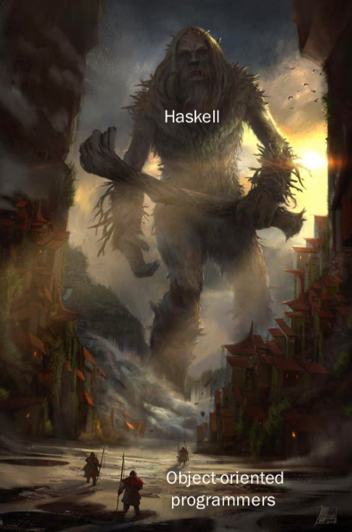
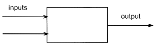
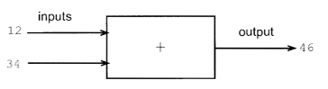
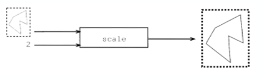
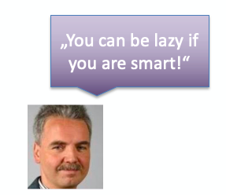
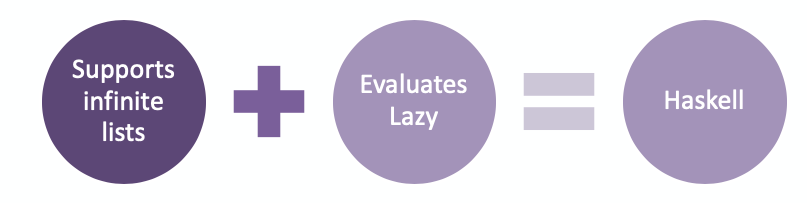

<!-- .slide: data-background="images/fontyslogo-background.png" -->
# Haskell introduction course

---

This Haskell Workshop is part of a course called PPAR - Programming Paradigms of Fontys University of Applied Sciences and is based on the the haskell workshop from two students who prepared it for the ESD - course in Informatics study programme at Fontys Venlo in 2018.

---

Thank you very much 
[Marco Kull](https://github.com/MarcoKull) and [Jan Evers](https://github.com/Backend-Giraffe).

---

## Organisational

### Purpose

The purpose of this workshop as part of the PPAR course is to give a brief introduction of Haskell by quickly **doing it**!

---

### The main learning goals

- Get familiar with Haskell language and its compiler
- Know what this functional programming language is and what the benefits of using it are
- Know and use some basic syntax of haskell
- Being able to create small haskell programs

---

### Course structure

The course is structured for 4 lecturing units where either short lecture or practical work on assignments will take place.

---

### Assignments

There will be **two** main Assignments which must be delivered into an individual Github repository provided by github classroom.

The invitation link to this assignments will be send during the lecture via mail and as channel-message.

**NOTE** you have to do all the assignments, *doing means pushed into your individual github repository*, in order to pass the Haskell part of this course.

---

- **Assignment 1**
  - consists of **6** individual programming exercises you have to do, to get a bit familiar with haskell.
  - Will be provided in the first lecturing unit. (First week)
  - **Deadline**: 27th May 2020

---

- **Assignment 2**
  - consist of **1** individual programming assignment
  - Will be provided in the third lecturing unit. (Third week)
  - **Deadline**: 17th June 2020
  
---

# Principles of functional programming

---

> Functional programming is a programming paradigm a style of building the structure and elements of computer programs that treats computation as the evaluation of mathematical functions and avoids changing-state and mutable data -
*Wikipedia*

---
<!-- .slide: data-background="images/haskell-intro.png" -->



---

## Pure functions

- Returns same result if given same arguments, also referred as deterministic.
- It does not cause any observable side effects.  
- What is then an impure function??? 
    - Imagine a java class with a field, where the field will be used in a calculation. This field was not passed as parameter to the function! The java class has a state which could have influence on the method.

---

## No side-effects

- No change of reference variables
- e.g. in Java, passed by reference parameters!!! If you change the value of the passed parameter, you change the whole reference variable. 
  
---

## Immutability

- „unchanging over time or Unable to change“
  
---

# What is a function

- Function has inputs and an output



---

- Output (result) depends on the inputs (parameters)
- Simple example: 



---

- Another example:



---

# What is Haskell

- Purely functional programming language
- You tell the computer what stuff is, rather than what to do (declarative style)
- Features:
  - Type inference
  - Statically typed
  - Lazy evaluation
  - Immutability
  - Non-null
  - ...
  
---  



---

# To infinity and beyond



---

Infinite data structures cheat sheet:

```haskell
    --------- lists by enumeration
    x1 = [1, 9, 42]
    x2 = [3 .. 7]                                   -- [3, 4, 5, 6, 7]
    x3 = [3, 5 .. 10]                               -- [3, 5, 7, 9]
    x4 = [10, 9 .. 5]                               -- [10, 9, 8, 7, 6, 5]
    x5 = [100, 90 .. 60]                            -- [100, 90, 80, 70, 60]
    x6 = sum [1,2..10]                              -- 55
    x7 = product [1,2,3]                            -- 6
    x8 = length x1                                  -- 3
    ---------- lists by comprehension   
    x9 = [ x + 1 | x <- x1 ]                        -- [2, 10, 43]
    x10 = [ sum [1..x] | x <- x3 ]                  -- [6, 15, 28, 45]
    x11 = [ x | x <- [1,2,3,4,5,6], mod x 2 == 1 ]  -- [1, 3, 5]
    ---------- infinite lists
    x12 = [5, 10 ..]                                -- [5, 10, 15, 20, ...]
    x13 = take 3 [5, 10 ..]                         -- [5, 10, 15]
```

---

# Where are my loops

---
<!-- .slide: data-background="images/loops.png" -->


---

- Remember: imperative vs. declarative style
- But how do I work with lists then?
  - MAP
    - Transform elements in a list
  - FOLD (left, right)
    - Reduce list to one value
  - ZIP (with)
    - Combine elements from two lists
  - FILTER
    - Well... removing some elements
- Do you remember lambda calculus?

---

```haskell
{-
Here you can find some simple examples on:
FILTER, MAP, ZIP and FOLD
-}

hundredIntegers = [1..100]

-- Filter Example
productsOfFive = filter (\ x -> x `mod` 5 == 0) hundredIntegers -- [5,10,15,20,25...]
-- Map Example
increasedInts = map (\ x -> x + 100) hundredIntegers -- [101,102,103,104,105,106...]
-- Zip Example
tuples = zip hundredIntegers [1..1000] -- [(1,1),(2,2),(3,3),(4,4)...]
-- Zipwith Example
noTuplesAnymore = zipWith (+) hundredIntegers [1..1000]  -- [2,4,6,8,10,12,14...]
-- Fold Example (You have to start left or right)
reducedToOne = foldl1 (+) hundredIntegers -- 5050
```

---

# Pure functions in Haskell

- All functions take a parameter
- All functions must return a value
- Anytime a function is called with the same parameter it returns the same value
  - *Output depends ONLY on parameters*

---

# Preparation

- **[Prepare your environment](https://github.com/FontysVenlo/haskell-introduction/blob/master/preparation.md)**
  
- **Everything is also available as PDF on Fontys connect**

