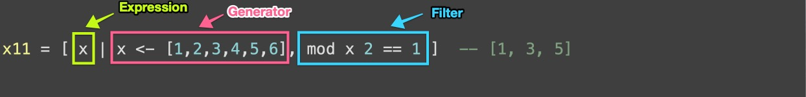

# Haskell basics

### basic syntax 
<!-- .slide: data-background="images/slides-headline-background.jpg" -->
<!-- s -->

## Infix and Prefix call syntax

- Both — operators and functions — can be called in prefix and infix
- Wrap operator in () to call in prefix
- Wrap function in `` (bacticks, ~ on keyboard) to call in infix

```haskell
ghci> 3 + 4
7
ghci> (+) 3 4
7
ghci> mod 7 3    -- 7 modulo 3
1
ghci> 7 `mod` 3
1
```
<!-- .element: class="fragment" -->

<!-- s -->

## Function declaration

```haskell
-- This function adds first number to product of second and third
addMul :: Int -> Int -> Int -> Int  -- This is type signature of 'addMul'
addMul x y z = x + y * z            -- This is definition     of 'addMul'

-- Btw, single-line comments start with --
greet :: String -> String
greet name = "Hello, " ++ name ++ "!"
```
<!-- .element: class="fragment" -->

```haskell
$ stack ghci  # from folder where 'Lecture.hs' is
ghci> :l Lecture.hs  -- :l is short form of :load command
ghci> addMul 1 2 3
7
ghci> greet "Haskell World"
"Hello, Haskell World!"
```
<!-- .element: class="fragment" -->
<!-- s -->

## Lists

```haskell
ghci> [1 + 2, 3 + 4, 5 * 6]  -- comma-separated
[3,7,30]
```
<!-- .element: class="fragment" -->

```haskell
ghci> list
[2, 1, 3]
ghci> reverse list  -- this doesn't change 'list'
[3, 1, 2]
ghci> list
[2, 1, 3]
ghci> let anotherList = 5 : list  -- new variable to save changes
ghci> anotherList
[5, 2, 1, 3]
ghci> list
[2, 1, 3]
```
<!-- .element: class="fragment" -->
<!-- s -->

## Ranges

### Java 8

```java
IntStream.range(0, 5).toArray();                    // {0, 1, 2, 3, 4};
IntStream.rangeClosed(0, 5).toArray();              // {0, 1, 2, 3, 4, 5};
IntStream.iterate(0, x -> x + 2).limit(5).toArray() // {0, 2, 4, 6, 8};
```
<!-- .element: class="fragment" -->

### Python

```python
range(5)       # 0, 1, 2, 3, 4
range(1, 5)    # 1, 2, 3, 4
range(1, 5, 2) # 1, 3
```
<!-- .element: class="fragment" -->

### Haskell

```haskell
[0 .. 5]     -- [0, 1, 2, 3, 4, 5]
[1, 3 .. 5]  -- [1, 3, 5, 7]
[0..]        -- [0, 1, 2, 3, ...] : infinite list
[0, 2 ..]    -- [0, 2, 4, 6, ...] : all even numbers
[5, 4 .. 1]  -- [5, 4, 3, 2, 1]
[5 .. 1]     -- [] — empty list
```
<!-- .element: class="fragment" -->
<!-- s -->

## List functions

```haskell
ghci> drop 2 [2, 1, 3]
[3]
```
<!-- .element: class="fragment" -->

```haskell
ghci> [2, 1, 3] !! 2  -- l !! i ≡ l[i], O(i) time
3
```
<!-- .element: class="fragment" -->

```haskell
ghci> take 1 [2, 1, 3]
[2]
```
<!-- .element: class="fragment" -->

```haskell
ghci> replicate 3 [1..5]
[[1,2,3,4,5], [1,2,3,4,5], [1,2,3,4,5]]
```
<!-- .element: class="fragment" -->

```haskell
ghci> zip [1,2,3] "abc"
[(1, 'a'), (2, 'b'), (3, 'c')]  -- (1, 'a') is pair of type (Int, Char)
```
<!-- .element: class="fragment" -->

```haskell
ghci> unzip [(5, True), (10, False)]
([5, 10], [True, False])
```
<!-- .element: class="fragment" -->

```haskell
ghci> words "Hello,    Haskell  \t\n\n   world!"
["Hello,", "Haskell", "world!"]
```
<!-- .element: class="fragment" -->

```haskell
ghci> unwords ["Hello,", "Haskell", "world!"]
"Hello, Haskell world!"
```
<!-- .element: class="fragment" -->
<!-- s -->

## List comprehension explained

```haskell
x11 = [ x | x <- [1,2,3,4,5,6], mod x 2 == 1 ]  -- [1, 3, 5]
```
<!-- .element: class="fragment" -->


<!-- .element: class="fragment" -->

- Generate a list from 1-6<!-- .element: class="fragment" -->
- Assign it to x<!-- .element: class="fragment" -->
- for each x filter it by modulo operation with rest 1<!-- .element: class="fragment" -->

<!-- s -->

## Own data types - ADT

- aka ADT - Algebraic Data Types

### Examples

```haskell
data Temp   = Cold | Hot
data Season = Spring | Summer | Autumn | Winter
```
<!-- .element: class="fragment" -->

- Type Temp has two members, Cold and Hot 
<!-- .element: class="fragment" -->
- Season has four members
<!-- .element: class="fragment" -->
- Formally: Hot and Cold are the constructors of type Temp
<!-- .element: class="fragment" -->

<!-- s -->

- Now describe the "British" Weather by defining a function over these types with pattern matching. We might say:

```haskell
weather :: Season -> Temp

weather Summer = Hot
weather _      = Cold
```
<!-- .element: class="fragment" -->

- British weather is only in the summer hot<!-- .element: class="fragment" -->
- Rest of the year it is cold<!-- .element: class="fragment" -->

<!-- s -->

### Deriving instances of classes

- lot of build in classes in haskell<!-- .element: class="fragment" -->
  - Eq for equality inequality<!-- .element: class="fragment" -->
  - Ord build on Eq, giving an ordering over Elements of a type<!-- .element: class="fragment" -->
  - Enum allowing the type to be enumerated, allowing [n .. m] expressions<!-- .element: class="fragment" -->
  - Show allowing elements to be turned into textual form<!-- .element: class="fragment" -->

To supply our data type with that: <!-- .element: class="fragment" -->

```haskell
data Season = Spring | Summer | Autumn | Winter
              deriving (Eq,Ord,Enum,Show,Read)
```
<!-- .element: class="fragment" -->

Now we can do: <!-- .element: class="fragment" -->

```haskell
[Sprint .. Autumn]
-- gives us
[Spring, Summer, Autumn]
```
<!-- .element: class="fragment" -->