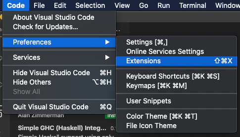
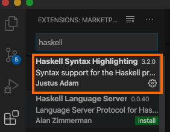
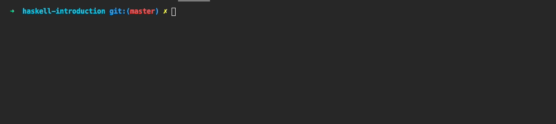

# Preparation

In order to be actively involved in our workshop we ask you to install the Glasgow Haskell Compiler (ghc) and preferably a [Haskell-aware text editor](https://wiki.haskell.org/Editors) in advance.

I suggest to use - [Visual Studio Code - Code Editing. Redefined](https://code.visualstudio.com/). 

Maybe you have to install the Haskell syntax highlighting extension:





You can play around with the **Haskelly** extension which is a full IDE extension, however, this was not fully working so you could face issues. If you have any issues, deactivate it and use Haskell syntax highlighting extension only. 

## Install ghc

The following sections describe the most common steps to install [ghc](https://wiki.haskell.org/GHC) on different platforms. If you need more assistance you can go to [the official Haskell site](https://www.haskell.org/platform/) or simply ask us directly.

### Linux

In all major distributions ghc is included and can be installed using the native package manager.
For Debian based systems like Ubuntu or Mint this would be:
```
sudo apt-get install ghc
```

### Windows

Download and install the [core package](https://haskell.org/platform/download/8.4.3/HaskellPlatform-8.4.3-core-x86_64-setup.exe). Afterwards you should be able to invoke ghc from command prompt:

```bash
C:\>ghc --version
The Glorious Glasgow Haskell Compilation System, version 8.4.3
```

### MacOS

Download and install the [core package](https://haskell.org/platform/download/8.6.3/Haskell%20Platform%208.6.3%20Core%2064bit-signed.pkg).

Open a terminal in mac via **Spotlight** to test it.


```bash
> ghc --version
The Glorious Glasgow Haskell Compilation System, version 8.6.3
```

## First Steps

This section describes how to create a simple "Hello World!" example to make sure you are ready to go. For convenience those steps are appropriate for any unix-like system, if you are using something inferior you will need to adjust the steps accordingly.

1.  Create a file named hello.hs containing the programm code:

nerd version:
   
    ```bash
    echo "hello=print(\"Hello ${USER}, thank you for your good preparation.\")" > hello.hs
    ```

or just put in a file called `hello.hs`the following:

```haskell
-- hello.hs
hello=print("Hello, thank you for your good preparation.")
```

2.  Open up the interactive complier:
    ```bash
    ghci
    ```

3.  Load the hello.hs file. (Tip: you can use autocompletion just as you do in your shell.)
   
    ```haskell
    :l hello.hs
    ```

4.  Call the method by typing ```hello```. If you can see the message, get yourself some reward (grab a 🍺 or something). 



## Compiling

Some hints regarding compiling. Look into hello_main.hs, you need some adaption (main function) to get a running file. 

```bash
ghc hello_main.hs
```
provides a 12 MB file. Pretty huge, however we can activate dynamic linking by doing:

```
stack ghc -- -dynamic hello.hs
```

will create a 17kb file. For us it makes no difference, 12 MB file is ok, as we do not create huge programs. But keep that in mind if you create executable binaries from haskell code. 

## Git and Github

You can use the Git-Plugins of your IDE, e.g. in Visual Studio, IntelliJ or Netbeans, simply install the GIT Plugin.

Then use GIT from your IDE.

You can also download a standalone UI Git Client. Here are some:

- [SourceTree](https://confluence.atlassian.com/get-started-with-sourcetree)
- [TortoiseGit](https://tortoisegit.org/) (Windows only)
- [Tower](https://www.git-tower.com/mac)
- [GitKraken](https://www.gitkraken.com/) - Note that connection with GitKraken might not be working due to adding oauth or token accessing. 

If you would like to use GIT via console, have a look at this video.

- [Git Tutorial for Beginners: Command-Line Fundamentals - YouTube](https://www.youtube.com/watch?v=HVsySz-h9r4)

## Additional Material

Below you find some additional material you can use for studying.

### Links

- [Chapters - Learn You a Haskell for Great Good!](http://learnyouahaskell.com/chapters)
- [An Introduction to the basic principles of Functional Programming](https://www.freecodecamp.org/news/an-introduction-to-the-basic-principles-of-functional-programming-a2c2a15c84/)
- [HaskellWiki](https://wiki.haskell.org/Haskell)
- [Presentations by ITMO CTD Haskell](https://slides.com/fp-ctd/)

### Some Nice Videos on Haskell

- [Haskell Tutorial - YouTube](https://www.youtube.com/watch?v=02_H3LjqMr8)
- [Infinite Data Structures: To Infinity & Beyond! - Computerphile - YouTube](https://www.youtube.com/watch?v=bnRNiE_OVWA)
